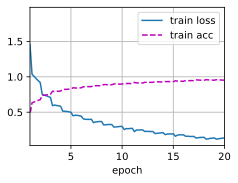

# <center> 数据科学 半期作业
何尉宁 2021213599 2021219106班
## 任务列表
**必做：**

- [安装配置Pytorch环境，检测Pytorch安装情况](#one1)
- [使用包含三层以上个卷积层的神经网络对CIFAR-10数据集分类。对生成网络结构进行截图，并对训练过程的精度增长和loss收敛情况进行截图](#one2)
- [对CIFAR-10数据进行解析和可视化展示。输出CIFAR-10数据集训练集、测试集大小；输出数据集包含的所有类别名称及与label对应情况；输出数据集中一张图片的数组size，并将数据集测试集三张图片进行可视化展示](#one3)
- [修改网络结构（调整网络深度，使用不同的激活函数，调整神经元数量）或更改训练参数（学习率，batch_size)，分析不同网络参数对于检测结果影响（至少分析两个变量，应有改动的关键代码段截图、前后效果对比与文字解析）](#one4)
- [使用tensorboard插件对训练过程中的loss和精度进行观察，对tensorboard中loss曲线和accuracy曲线进行截图记录](#one5)
- [使用训练模型对于测试集中第i到i+10张图片进行预测，输出预测结果与预测概率softmax（i=学号最后两位*10）](#one6)
  

**选做：**

- [比较仅使用单通道（R通道）作为输入和使用三通道图像作为输入训练结果的差异](#two1)
- [尝试使用KNN等机器学习算法进行分类，并将其结果与卷积神经网络结果进行对比，分析结果差异](#two2)

<h2 id = 'one1'> 1. 环境配置 </h2>

![!\[\[Alt text\]\](ENV.png)](asset/ENV.png)

<h2 id = 'one2'> 2. CIFAR-10训练及结果展示 </h2>

### 2.1 网络结构展示
#### 2.1.1 CNN
```text
ConvNet(
  (conv1): Sequential(
    (0): Conv2d(3, 16, kernel_size=(3, 3), stride=(1, 1), padding=(1, 1))
    (1): BatchNorm2d(16, eps=1e-05, momentum=0.1, affine=True, track_running_stats=True)
    (2): ReLU()
    (3): MaxPool2d(kernel_size=2, stride=2, padding=0, dilation=1, ceil_mode=False)
  )
  (conv2): Sequential(
    (0): Conv2d(16, 32, kernel_size=(3, 3), stride=(1, 1), padding=(1, 1))
    (1): BatchNorm2d(32, eps=1e-05, momentum=0.1, affine=True, track_running_stats=True)
    (2): ReLU()
    (3): MaxPool2d(kernel_size=2, stride=2, padding=0, dilation=1, ceil_mode=False)
  )
  (conv3): Sequential(
    (0): Conv2d(32, 64, kernel_size=(3, 3), stride=(1, 1), padding=(1, 1))
    (1): BatchNorm2d(64, eps=1e-05, momentum=0.1, affine=True, track_running_stats=True)
    (2): ReLU()
    (3): MaxPool2d(kernel_size=2, stride=2, padding=0, dilation=1, ceil_mode=False)
  )
  (conv4): Sequential(
    (0): Conv2d(64, 128, kernel_size=(3, 3), stride=(1, 1), padding=(1, 1))
    (1): BatchNorm2d(128, eps=1e-05, momentum=0.1, affine=True, track_running_stats=True)
    (2): ReLU()
    (3): MaxPool2d(kernel_size=2, stride=2, padding=0, dilation=1, ceil_mode=False)
  )
  (conv5): Sequential(
    (0): Conv2d(128, 256, kernel_size=(3, 3), stride=(1, 1), padding=(1, 1))
    (1): BatchNorm2d(256, eps=1e-05, momentum=0.1, affine=True, track_running_stats=True)
    (2): ReLU()
    (3): MaxPool2d(kernel_size=2, stride=2, padding=0, dilation=1, ceil_mode=False)
  )
  (fc1): Sequential(
    (0): Linear(in_features=256, out_features=32, bias=True)
    (1): ReLU()
    (2): Dropout(p=0.2, inplace=False)
  )
  (fc2): Linear(in_features=32, out_features=10, bias=True)
)
```

#### 2.1.2 Resnet18
```text
Sequential(
  (0): Conv2d(3, 64, kernel_size=(3, 3), stride=(1, 1), padding=(1, 1))
  (1): BatchNorm2d(64, eps=1e-05, momentum=0.1, affine=True, track_running_stats=True)
  (2): ReLU()
  (resnet_block1): Sequential(
    (0): Residual(
      (conv1): Conv2d(64, 64, kernel_size=(3, 3), stride=(1, 1), padding=(1, 1))
      (conv2): Conv2d(64, 64, kernel_size=(3, 3), stride=(1, 1), padding=(1, 1))
      (bn1): BatchNorm2d(64, eps=1e-05, momentum=0.1, affine=True, track_running_stats=True)
      (bn2): BatchNorm2d(64, eps=1e-05, momentum=0.1, affine=True, track_running_stats=True)
    )
    (1): Residual(
      (conv1): Conv2d(64, 64, kernel_size=(3, 3), stride=(1, 1), padding=(1, 1))
      (conv2): Conv2d(64, 64, kernel_size=(3, 3), stride=(1, 1), padding=(1, 1))
      (bn1): BatchNorm2d(64, eps=1e-05, momentum=0.1, affine=True, track_running_stats=True)
      (bn2): BatchNorm2d(64, eps=1e-05, momentum=0.1, affine=True, track_running_stats=True)
    )
  )
  (resnet_block2): Sequential(
    (0): Residual(
      (conv1): Conv2d(64, 128, kernel_size=(3, 3), stride=(2, 2), padding=(1, 1))
      (conv2): Conv2d(128, 128, kernel_size=(3, 3), stride=(1, 1), padding=(1, 1))
      (conv3): Conv2d(64, 128, kernel_size=(1, 1), stride=(2, 2))
      (bn1): BatchNorm2d(128, eps=1e-05, momentum=0.1, affine=True, track_running_stats=True)
      (bn2): BatchNorm2d(128, eps=1e-05, momentum=0.1, affine=True, track_running_stats=True)
    )
    (1): Residual(
      (conv1): Conv2d(128, 128, kernel_size=(3, 3), stride=(1, 1), padding=(1, 1))
      (conv2): Conv2d(128, 128, kernel_size=(3, 3), stride=(1, 1), padding=(1, 1))
      (bn1): BatchNorm2d(128, eps=1e-05, momentum=0.1, affine=True, track_running_stats=True)
      (bn2): BatchNorm2d(128, eps=1e-05, momentum=0.1, affine=True, track_running_stats=True)
    )
  )
  (resnet_block3): Sequential(
    (0): Residual(
      (conv1): Conv2d(128, 256, kernel_size=(3, 3), stride=(2, 2), padding=(1, 1))
      (conv2): Conv2d(256, 256, kernel_size=(3, 3), stride=(1, 1), padding=(1, 1))
      (conv3): Conv2d(128, 256, kernel_size=(1, 1), stride=(2, 2))
      (bn1): BatchNorm2d(256, eps=1e-05, momentum=0.1, affine=True, track_running_stats=True)
      (bn2): BatchNorm2d(256, eps=1e-05, momentum=0.1, affine=True, track_running_stats=True)
    )
    (1): Residual(
      (conv1): Conv2d(256, 256, kernel_size=(3, 3), stride=(1, 1), padding=(1, 1))
      (conv2): Conv2d(256, 256, kernel_size=(3, 3), stride=(1, 1), padding=(1, 1))
      (bn1): BatchNorm2d(256, eps=1e-05, momentum=0.1, affine=True, track_running_stats=True)
      (bn2): BatchNorm2d(256, eps=1e-05, momentum=0.1, affine=True, track_running_stats=True)
    )
  )
  (resnet_block4): Sequential(
    (0): Residual(
      (conv1): Conv2d(256, 512, kernel_size=(3, 3), stride=(2, 2), padding=(1, 1))
      (conv2): Conv2d(512, 512, kernel_size=(3, 3), stride=(1, 1), padding=(1, 1))
      (conv3): Conv2d(256, 512, kernel_size=(1, 1), stride=(2, 2))
      (bn1): BatchNorm2d(512, eps=1e-05, momentum=0.1, affine=True, track_running_stats=True)
      (bn2): BatchNorm2d(512, eps=1e-05, momentum=0.1, affine=True, track_running_stats=True)
    )
    (1): Residual(
      (conv1): Conv2d(512, 512, kernel_size=(3, 3), stride=(1, 1), padding=(1, 1))
      (conv2): Conv2d(512, 512, kernel_size=(3, 3), stride=(1, 1), padding=(1, 1))
      (bn1): BatchNorm2d(512, eps=1e-05, momentum=0.1, affine=True, track_running_stats=True)
      (bn2): BatchNorm2d(512, eps=1e-05, momentum=0.1, affine=True, track_running_stats=True)
    )
  )
  (global_avg_pool): AdaptiveAvgPool2d(output_size=(1, 1))
  (fc): Sequential(
    (0): Flatten(start_dim=1, end_dim=-1)
    (1): Linear(in_features=512, out_features=10, bias=True)
  )
)
```

### 2.2 输出结果

#### 2.2.1 CNN训练效果(采用不同结构不同参数)：

1. Origin 3 layers CNN
```text
Epoch: 16 Loss: 0.016431 Acc: 64.880000 Time: 20.804
Epoch: 17 Loss: 0.016272 Acc: 65.296000 Time: 20.235
Epoch: 18 Loss: 0.016106 Acc: 65.846000 Time: 21.152
Epoch: 19 Loss: 0.015824 Acc: 66.322000 Time: 18.621
Epoch: 20 Loss: 0.015763 Acc: 66.666000 Time: 20.579
```

2. 5 layers CNN with BN
```text
Epoch: 16 Loss: 0.010760 Acc: 76.670000 Time: 21.312
Epoch: 17 Loss: 0.010581 Acc: 77.128000 Time: 21.635
Epoch: 18 Loss: 0.010377 Acc: 77.746000 Time: 22.356
Epoch: 19 Loss: 0.010248 Acc: 77.948000 Time: 21.549
Epoch: 20 Loss: 0.010058 Acc: 78.544000 Time: 21.471
```

3. 5 layers CNN with BN Dropout Softmax LR = 0.002
```text
Epoch: 16 Loss: 0.013222 Acc: 72.292000 Time: 21.861
Epoch: 17 Loss: 0.012902 Acc: 72.902000 Time: 21.849
Epoch: 18 Loss: 0.012691 Acc: 73.268000 Time: 21.877
Epoch: 19 Loss: 0.012457 Acc: 73.876000 Time: 21.781
Epoch: 20 Loss: 0.012290 Acc: 74.006000 Time: 21.507
```

#### 2.2.2 ResNet18训练效果：

输出结果：
```text
train loss 0.134,train acc 0.953
1530.4 examples/sec on [device(type='cuda', index=0)]
```


<h2 id = 'one3'> 3. 数据可视化展示 </h2>

### 3.1 数据集/训练集大小与Label
前面是 `dataset` 里的信息，后面是 `DataLoader` 里的，标签是 `Meta` 里的。
```output
Size of training data: 50000
Size of testing data: 10000
Number of training examples: 781
Number of testing examples: 157
Classes: ['airplane', 'automobile', 'bird', 'cat', 'deer', 'dog', 'frog', 'horse', 'ship', 'truck']
labels {'airplane': 0, 'automobile': 1, 'bird': 2, 'cat': 3, 'deer': 4, 'dog': 5, 'frog': 6, 'horse': 7, 'ship': 8, 'truck': 9}
```
### 3.2 图片Size与展示
我的`Batch_Size`是64，因为做了五个`Transform`所以得到的结果图片可能会有翻转。
```output
Shape of a batch of images: torch.Size([64, 3, 32, 32])
```


<h2 id = 'one4'> 4. 网络优化 </h2>

### 4.1 原始MLP
仅使用线性层，加入`Dropout`和`SoftMax`之后性能没有显著的提升，因为数据集的规模本身不算大，并且网络本身的性能上限较低，故最终结果较差。
```python
class MLP(torch.nn.Module):
    def __init__(self, input_size, hidden_size, num_classes):
        super(MLP, self).__init__()

        h1, h2, h3 = hidden_size
        self.linear1 = torch.nn.Linear(input_size, h1)
        self.relu1 = torch.nn.ReLU()
        self.linear2 = torch.nn.Linear(h1, h2)
        self.relu2 = torch.nn.ReLU()
        self.linear3 = torch.nn.Linear(h2, h3)
        self.relu3 = torch.nn.ReLU()
        self.linear4 = torch.nn.Linear(h3, num_classes)
        self.dropout = torch.nn.Dropout(0.25)
        self.softmax = torch.nn.Softmax(dim=1)

    def forward(self, x):
        out = self.linear1(x)
        out = self.relu1(out)
        # out = self.dropout(out)
        out = self.linear2(out)
        out = self.relu2(out)
        # out = self.dropout(out)
        out = self.linear3(out)
        out = self.relu3(out)
        out = self.dropout(out)
        out = self.linear4(out)
        # out = self.softmax(out)
        return out
```
```output
Epoch: 1 Loss: 0.027643 Acc: 36.910000 Time: 23.314
Epoch: 2 Loss: 0.025291 Acc: 42.934000 Time: 24.255
Epoch: 3 Loss: 0.024285 Acc: 45.066000 Time: 25.225
Epoch: 4 Loss: 0.023631 Acc: 46.622000 Time: 25.337
Epoch: 5 Loss: 0.023122 Acc: 47.740000 Time: 25.483
Finished Training
```

### 4.2 原始三层CNN
在卷积神经网络中效果最为平庸，三个卷积层的步长都是1，利用最大池化进行降维，最后通过线性层拟合10个类别。
```python
class ConvNet(torch.nn.Module):
    def __init__(self):
        super(ConvNet, self).__init__()
        self.conv1 = nn.Sequential(
            nn.Conv2d(3, 16, kernel_size=3, stride=1, padding=1),
            nn.ReLU(),
            nn.MaxPool2d(kernel_size=2, stride=2))
        self.conv2 = nn.Sequential(
            nn.Conv2d(16, 32, kernel_size=3, stride=1, padding=1),
            nn.ReLU(),
            nn.MaxPool2d(kernel_size=2, stride=2))
        self.conv3 = nn.Sequential(
            nn.Conv2d(32, 64, kernel_size=3, stride=1, padding=1),
            nn.ReLU(),
            nn.MaxPool2d(kernel_size=2, stride=2))
        self.fc1 = torch.nn.Sequential(
            nn.Linear(256, 32),
            nn.ReLU(),
        )
        self.fc2 = nn.Linear(32, 10)

    def forward(self, x):
        out = self.conv1(x)
        out = self.conv2(out)
        out = self.conv3(out)
        out = out.reshape(out.size(0), -1)
        out = self.fc1(out)
        out = self.fc2(out)
        out = nn.functional.log_softmax(out, dim=1)
        return out
```
```output
Epoch: 16 Loss: 0.016431 Acc: 64.880000 Time: 20.804
Epoch: 17 Loss: 0.016272 Acc: 65.296000 Time: 20.235
Epoch: 18 Loss: 0.016106 Acc: 65.846000 Time: 21.152
Epoch: 19 Loss: 0.015824 Acc: 66.322000 Time: 18.621
Epoch: 20 Loss: 0.015763 Acc: 66.666000 Time: 20.579
```

### 4.3 五层CNN 并加入 BatchNormalization
加深网络，并且使用 `BN` 牵制梯度消失的现象，得到比较好的结果，`EPOCHS` 设的是20，所以最后并没有完全收敛，否则会有更好的效果。
```python
class ConvNet(torch.nn.Module):
    def __init__(self):
        super(ConvNet, self).__init__()
        self.conv1 = nn.Sequential(
            nn.Conv2d(3, 16, kernel_size=3, stride=1, padding=1),
            nn.BatchNorm2d(16),
            nn.ReLU(),
            nn.MaxPool2d(kernel_size=2, stride=2))
        self.conv2 = nn.Sequential(
            nn.Conv2d(16, 32, kernel_size=3, stride=1, padding=1),
            nn.BatchNorm2d(32),
            nn.ReLU(),
            nn.MaxPool2d(kernel_size=2, stride=2))
        self.conv3 = nn.Sequential(
            nn.Conv2d(32, 64, kernel_size=3, stride=1, padding=1),
            nn.BatchNorm2d(64),
            nn.ReLU(),
            nn.MaxPool2d(kernel_size=2, stride=2))
        self.conv4 = nn.Sequential(
            nn.Conv2d(64, 128, kernel_size=3, stride=1, padding=1),
            nn.BatchNorm2d(128),
            nn.ReLU(),
            nn.MaxPool2d(kernel_size=2, stride=2))
        self.conv5 = nn.Sequential(
            nn.Conv2d(128, 256, kernel_size=3, stride=1, padding=1),
            nn.BatchNorm2d(256),
            nn.ReLU(),
            nn.MaxPool2d(kernel_size=2, stride=2))
        self.fc1 = torch.nn.Sequential(
            nn.Linear(256, 32),
            nn.ReLU(),
        )
        self.fc2 = nn.Linear(32, 10)

    def forward(self, x):
        out = self.conv1(x)
        out = self.conv2(out)
        out = self.conv3(out)
        out = self.conv4(out)
        out = self.conv5(out)
        out = out.reshape(out.size(0), -1)
        out = self.fc1(out)
        out = self.fc2(out)
        return out
```
```text
Epoch: 16 Loss: 0.010760 Acc: 76.670000 Time: 21.312
Epoch: 17 Loss: 0.010581 Acc: 77.128000 Time: 21.635
Epoch: 18 Loss: 0.010377 Acc: 77.746000 Time: 22.356
Epoch: 19 Loss: 0.010248 Acc: 77.948000 Time: 21.549
Epoch: 20 Loss: 0.010058 Acc: 78.544000 Time: 21.471
```

### 4.4 五层CNN 加入BN Dropout Softmax LR = 0.002
增大了学习率，加入 `dropout` 防止过拟合的现象产生，同时最后通过 `Softmax` 函数，使得分类结果更加的稀疏。
```python
class ConvNet(torch.nn.Module):
    def __init__(self):
        super(ConvNet, self).__init__()
        self.conv1 = nn.Sequential(
            nn.Conv2d(3, 16, kernel_size=3, stride=1, padding=1),
            nn.BatchNorm2d(16),
            nn.ReLU(),
            nn.MaxPool2d(kernel_size=2, stride=2))
        self.conv2 = nn.Sequential(
            nn.Conv2d(16, 32, kernel_size=3, stride=1, padding=1),
            nn.BatchNorm2d(32),
            nn.ReLU(),
            nn.MaxPool2d(kernel_size=2, stride=2))
        self.conv3 = nn.Sequential(
            nn.Conv2d(32, 64, kernel_size=3, stride=1, padding=1),
            nn.BatchNorm2d(64),
            nn.ReLU(),
            nn.MaxPool2d(kernel_size=2, stride=2))
        self.conv4 = nn.Sequential(
            nn.Conv2d(64, 128, kernel_size=3, stride=1, padding=1),
            nn.BatchNorm2d(128),
            nn.ReLU(),
            nn.MaxPool2d(kernel_size=2, stride=2))
        self.conv5 = nn.Sequential(
            nn.Conv2d(128, 256, kernel_size=3, stride=1, padding=1),
            nn.BatchNorm2d(256),
            nn.ReLU(),
            nn.MaxPool2d(kernel_size=2, stride=2))
        self.fc1 = torch.nn.Sequential(
            nn.Linear(256, 32),
            nn.ReLU(),
            nn.Dropout(0.2)
        )
        self.fc2 = nn.Linear(32, 10)

    def forward(self, x):
        out = self.conv1(x)
        out = self.conv2(out)
        out = self.conv3(out)
        out = self.conv4(out)
        out = self.conv5(out)
        out = out.reshape(out.size(0), -1)
        out = self.fc1(out)
        out = self.fc2(out)
        out = nn.functional.log_softmax(out, dim=1)
        return out
```
```output
Epoch: 16 Loss: 0.013222 Acc: 72.292000 Time: 21.861
Epoch: 17 Loss: 0.012902 Acc: 72.902000 Time: 21.849
Epoch: 18 Loss: 0.012691 Acc: 73.268000 Time: 21.877
Epoch: 19 Loss: 0.012457 Acc: 73.876000 Time: 21.781
Epoch: 20 Loss: 0.012290 Acc: 74.006000 Time: 21.507
```

### 4.5 ResNet18
直接使用ResNet，把网络叠得更深，最终达到96的准确率。

<h2 id = 'one5'> 5. TensorBoard绘图 </h2>

如图可见四种不同网络结构的区别，5层CNN加BN的效果最好，在损失函数方面，能明显看到MLP的性能远不如CNN。
### 5.1 ACC
](asset/ACC.png)
### 5.2 LOSS
](asset/LOSS.png)

<h2 id = 'one6'> 6. 测试集10张图片展示 </h2>

我的学号尾数是"3599"，所以抽取第990至1000张图片进行预测。
### 6.1 图片展示

### 6.2 预测与Softmax
```output
Predicted:  bird automobile   cat   dog horse   cat   dog automobile   cat   dog
GroundTruth:  bird automobile   cat   dog horse   cat   dog automobile   cat   dog
Softmax:  tensor([2, 1, 3, 5, 7, 3, 5, 1, 3, 5], device='cuda:0')
```

<h2 id = 'two1'> 7. 单通道训练 </h2>

在 `Transform` 中只保留L通道，即R通道，`torchvision.transforms.Lambda(lambda x: x.convert('L'))`，同时修改网络结构使第一层网络的通道数为1。\
理论上来说修改后准确率会降低，R通道相当于只保留亮度特征，图片转换为灰度图像，损失了两个通道的信息，特征直接丢失一大半。\
但实际上效果并没有特别大的退化，因为处理的时候转换为数值，有些色度信息会有冗余。

```output
Epoch: 16 Loss: 0.013446 Acc: 0.705360 Time: 19.930
Epoch: 17 Loss: 0.013219 Acc: 0.708860 Time: 20.233
Epoch: 18 Loss: 0.013048 Acc: 0.712120 Time: 20.087
Epoch: 19 Loss: 0.012899 Acc: 0.715520 Time: 19.926
Epoch: 20 Loss: 0.012817 Acc: 0.716800 Time: 19.851
Finished Training
```

<h2 id = 'two2'> 8. KNN </h2>

CNN相对于KNN在CIFAR-10上达到更高的准确率，因为CNN能够学习更复杂、抽象的特征表示，适用于高维度图像数据。CNN通过多层卷积和池化操作有效捕捉图像中的局部和全局模式，而KNN则可能在高维空间中受到限制。此外，CNN的端到端训练使其能够学习更高层次的语义信息。KNN对于高维度数据敏感，可能需要更多的特征工程或降维操作。

```output
Batch:  152 Acc: 0.531250
Batch:  153 Acc: 0.609375
Batch:  154 Acc: 0.656250
Batch:  155 Acc: 0.703125
Batch:  156 Acc: 0.687500
Loss: 0.015150 Acc: 0.663400
```